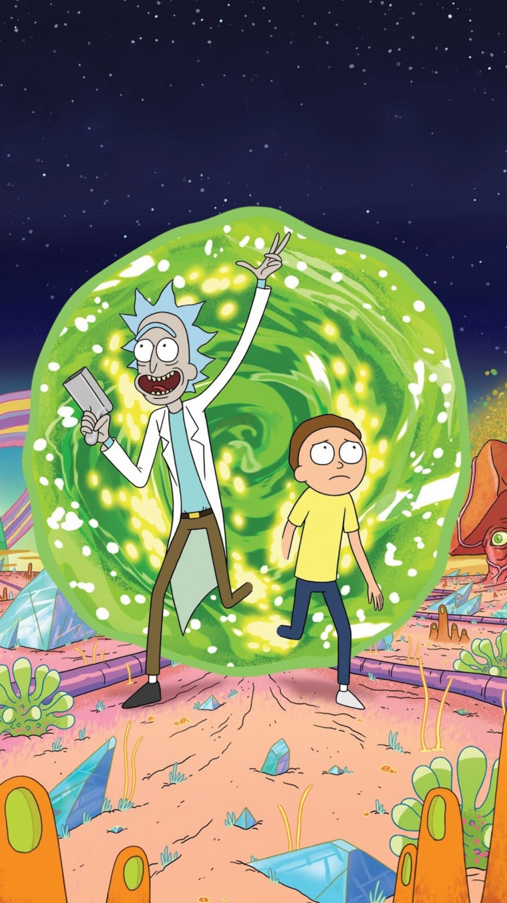

# Mosaic

This project is used to create mosaic of your chosen images from a set of tiles.
A mosaic is a collection of images put together to make it look like another image. 

To make these you need to have many pictures of different color combinations. Something like every frame of a movie, or any other images.
Just make sure the no. of images are atleast 100.

We will use Pillow Library of Pythonfor working with the images.

Do not worry about the size of image, as the script will crop and resize them before generating the results.

Enter this in command line to run the script, as follows:

<pre>python mosaic.py &lt;image_file_path&gt; &lt;tiles_directory&gt;
</pre>

*   The `image_file_path` argument should contain the path to the image for which you want to build the mosaic.
*   The `tiles directory` argument should contain the path to the directory containing the tile images (the directory will be searched recursively, so it doesn't matter if some of the images are contained in sub-directories)
*   Make sure the parent directory of ```mosaic.py``` and the directories image, tiles is same.

For example:

<pre>python mosaic.py images/tu.jpg tiles/
</pre>

The images below show an example of how the mosaic tiles are matched to the details of the original image:

  
<span class="smallText">Original</span>

[](rick-morty/result/result.jpeg)  


Explaining the code:

The uses of variables is given in the python script itsel.
We created a class named TileProcessor and in that class the first method is process style process tile this method. This method crops the images off the tiles that are used for making the whole mosaic.
Next we have get tiles in which we declared two lists. Using the os packet package we will Traverse through the tile directory and segregate images into large and small tiles. Now we talked about a new class named TargetImage this has a get data method which will increase the size of the original image and return a list small image and large image. 
